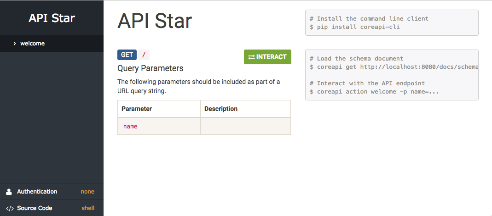
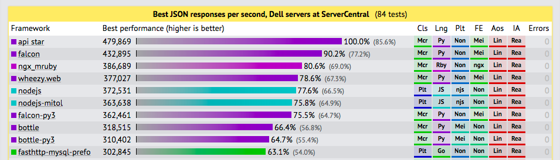

# API Star ✨🚀✨🌟

A smart Web API framework, designed for Python 3.

[](https://travis-ci.org/encode/apistar)
[](https://codecov.io/gh/encode/apistar)
[](https://pypi.python.org/pypi/apistar)
[](https://www.python.org/doc/versions/)

**Community:** https://discuss.apistar.org/ 🤔 💭 🤓 💬 😎


---

# Features

Why should you consider using API Star for your next Web API project?

* **API documentation** - Interactive API documentation, that's guaranteed to always
be in sync with your codebase.
* **Client libraries** - JavaScript and Python client libraries, driven by the typesystems that API Star generates.
* **Schema generation** - Support for generating Swagger or RAML API typesystems.
* **Expressive** - Type annotated views, that make for expressive, testable code.
* **Performance** - Dynamic behaviour for determining how to run each view makes API Star incredibly efficient.
* **Throughput** - Support for asyncio to allow for building high-throughput non-blocking applications.

---

# Table of Contents

- [Quickstart](#quickstart)
    - [Choosing a framework](#choosing-a-framework)
- [HTTP](#http)
    - [Requests](#requests)
    - [Responses](#responses)
    - [URL Routing](#url-routing)
    - [Command Routing](#command-routing)
- [Type System](#type-system)
    - [Data Validation](#data-validation)
    - [Serialization](#serialization)
    - [Generating API Schemas](#generating-api-schemas)
- [Building Websites](#building-websites)
    - [Templates](#templates)
    - [Static Files](#static-files)
    - [HTTP Sessions](#http-sessions)
- [Renderers & Parsers](#renderers--parsers)
    - [Renderers](#renderers)
    - [Parsers](#parsers)
- [Authentication & Permissions](#authentication--permissions)
    - [Authentication](#authentication)
    - [Permissions](#permissions)
- [Settings & Environment](#settings--environment)
    - [Application settings](#application-settings)
    - [Environment](#environment)
- [Testing](#testing)
- [Backends](#backends)
  - [SQLAlchemy](#sqlalchemy)
  - [Django ORM](#django-orm)
- [Components](#components)
- [Performance](#performance)
- [Deployment](#deployment)
    - [The Development Server](#the-development-server)
    - [Running in Production](#running-in-production)
    - ["Serverless" Deployments](#serverless-deployments)
- [Changelog](#changelog)
    - [0.3 Release](#03-release)
    - [0.2 Release](#02-release)
- [Development](#development)

---

# Quickstart

Install API Star:
```bash
$ pip3 install apistar
```
Create a new project:
```bash
$ apistar new .
app.py
tests.py
$ cat app.py
```
```python
from apistar import Include, Route
from apistar.frameworks.wsgi import WSGIApp as App
from apistar.handlers import docs_urls, static_urls


def welcome(name=None):
    if name is None:
        return {'message': 'Welcome to API Star!'}
    return {'message': 'Welcome to API Star, %s!' % name}


routes = [
    Route('/', 'GET', welcome),
    Include('/docs', docs_urls),
    Include('/static', static_urls)
]

app = App(routes=routes)


if __name__ == '__main__':
    app.main()
```
Run the application:
```bash
$ apistar run
Running at http://localhost:8080/
```
Run the tests:
```bash
$ apistar test
tests.py ..
===== 2 passed in 0.05 seconds =====
```
View the interactive API documentation:
```bash
$ open http://localhost:8080/docs/
```


## Choosing a framework

API Star allows you to either use a standard threaded WSGI application, or an asyncio application.

### WSGI

The benefit of choosing a standard WSGI application is that you'll get better
ecosystem support. The SQLAlchemy and Django ORM backends are available,
and you can use a large range of existing Python libraries.

To start a new `wsgi` project use:
```bash
$ pip install apistar
$ apistar new .
```
The application import line in the code will look like this:
```python
from apistar.frameworks.wsgi import WSGIApp as App
```
### ASyncIO

The benefit of an asyncio application is the potential for higher throughput,
as you can avoid making thread-blocking calls in favour of co-operative concurrency
using async/await. However you'll need to make sure that you only use async components
for any blocking operations, such as calls to the database, reading from disk, or
making a network request.

To start a new `asyncio` project use:
```bash
$ pip install apistar[asyncio]
$ apistar new . --framework asyncio
```
The application import line in the code will look like this:
```python
from apistar.frameworks.asyncio import ASyncIOApp as App
```
You may now include either regular or async handler functions...
```python
def welcome(name=None):
    # A regular handler function that contains no asynchronous operations.
    ...

async def welcome(name=None):
    # An async handler, that may use `async/await` syntax for performing asynchronous operations.
    ...
```
---

# HTTP

## Requests

API Star allows you to dynamically inject various information about the
incoming request into your views using type annotation.

```python
from apistar import http

def show_request(request: http.Request):
    return {
        'method': request.method,
        'url': request.url,
        'headers': dict(request.headers)
    }

def show_query_params(query_params: http.QueryParams):
    return {
        'params': dict(query_params)
    }

def show_user_agent(user_agent: http.Header):
    return {
        'user-agent': user_agent
    }
```

Some of the components you might use most often:

| Component          | Description |
| ------------------ | ----------- |
| `http.Request`     | The HTTP request. Includes `.method`, `.url`, and `.headers` attributes. |
| `http.Headers`     | The request headers, returned as a dictionary-like object. |
| `http.Header`      | Lookup a single request header, corresponding to the argument name.<br/>Returns a string or `None`. |
| `http.QueryParams` | The request query parameters, returned as a dictionary-like object. |
| `http.QueryParam`  | Lookup a single query parameter, corresponding to the argument name.<br/>Returns a string or `None`. |
| `http.Body`        | The request body. Returns a bytestring. |
| `http.RequestData` | The parsed request data. Data type will depend on the Content-Type of the request. |

## Responses

By default API star expects view to return plain data, and will return
`200 OK` responses.

```python
def create_project():
    return {'name': 'new project', 'id': 123}
```

You can instead set the status code or headers by returning a `Response`.

```python
def create_project():
    data = {'name': 'new project', 'id': 123}
    headers = {'Location': 'http://example.com/project/123/'}
    return Response(data, status=201, headers=headers)
```

## URL Routing

Use `{curly_braces}` in your URL conf to include a URL path parameter.


```python
def echo_username(username):
    return {'message': f'Welcome, {username}!'}

app = App(routes=[
    Route('/{username}/', 'GET', echo_username)
])
```

Use `Include` to include a list of routes.

```python
user_routes = [
    Route('/', 'GET', list_users),
    Route('/', 'POST', create_user),
    Route('/{user_id}', 'PUT', edit_user),
    Route('/{user_id}', 'DELETE', delete_user)
]

routes = [
    Include('/users', user_routes),
    ...
]

app = App(routes=routes)
```

Use type annotation on the view method to include typed URL path parameters.

```python
users = {0: 'penny', 1: 'benny', 2: 'jenny'}

def echo_username(user_id: int):
    username = users[user_id]
    return {'message': f'Welcome, {username}!'}

app = App(routes=[
    Route('/{user_id}/', 'GET', echo_username)
])
```

Parameters which do not correspond to a URL path parameter will be treated as
query parameters for scalar types such as `int` or `str`, or part of the
request body for composite types of `dict` and `list`.

```python
def echo_username(username):
    if username is None:
        return {'message': 'Welcome!'}
    return {'message': f'Welcome, {username}!'}

app = App(routes=[
    Route('/hello/', 'GET', echo_username)
])
```

### Reversing URLS

Rather than build URLs by hand, it is possible to generate URLs based on the endpoint, using `Router's reverse_url()`.

```python
from apistar.interfaces import Router

def get_player_details(player_name):
    score = get_score(player_name)
    return {'name': player_name, 'score': score}

def get_all_players(router: Router):
    players = get_players()
    player_list = [
        {
            'name': player.name,
            'url': router.reverse_url('get_player_details', {'player_name': player.name})
        }
        for player in players
    ]
    return {'players': player_list}

app = App(routes=[
    Route('/players/', 'GET', get_all_players),
    Route('/players/{player_name}/', 'GET', get_player_details),
])
```

## Command Routing

In addition to routing URLs, you can also route commands, to make additional
functionality available directly to the command line client.

For example...

```python
from apistar import Command
from apistar.frameworks.wsgi import WSGIApp as App

...

routes = [
    ...
]

commands = [
    Command('create_user', create_user),
    Command('delete_user', delete_user)
]

app = App(routes=routes, commands=commands)
```

---

# Type System

API Star comes with a type system that allows you to express constraints on the
expected inputs and outputs of your interface.

Here’s a quick example of what the type system in API Star looks like:

```python
from apistar import typesystem

class Rating(typesystem.Integer):
    minimum = 1
    maximum = 5


class ProductSize(typesystem.Enum):
    enum = ['small', 'medium', 'large']


class Product(typesystem.Object):
    properties = {
        'name': typesystem.string(max_length=100),  # Use lowercase functions for inline declarations.
        'rating': Rating,
        'in_stock': typesystem.Boolean,
        'size': ProductSize,
    }
```

## Data Validation

The main benefit of expressing our data constraints in a type system is that we
can then use those types as annotations on our handler functions.

```python
def create_product(product: Product):
    ...

routes = [
    Route('/create_product/', 'POST', create_product)
]
```

## Serialization

In addition to using the typesystem types for input validation, you can also use
them to serialize the return values of your handler functions.

```python
import typing


def list_products() -> typing.List[Product]:
    queryset = ...  # Query returning products from a data store.
    return [Product(record) for record in queryset]
```

## API Reference

The following typesystem types are currently supported:

### String

Validates string data. A subclass of `str`.

* `default` - A default to be used if a field using this typesystem is missing from a parent `Object`.
* `max_length` - A maximum valid length for the data.
* `min_length` - A minimum valid length for the data.
* `pattern` - A string or compiled regex that the data must match.
* `format` - An identifier indicating a complex datatype with a string representation. For example `"date"`, to represent an ISO 8601 formatted date string.
* `trim_whitespace` - `True ` if leading and trailing whitespace should be stripped from the data. Defaults to `True`.
* `description` - A description for online documentation

### Number

Validates numeric data. A subclass of `float`.

* `default` - A default to be used if a field using this typesystem is missing from a parent `Object`.
* `maximum` - A float representing the maximum valid value for the data.
* `minimum` - A float representing the minimum valid value for the data.
* `exclusive_maximum` - `True` for an exclusive maximum limit. Defaults to `False`.
* `exclusive_minimum` - `True` for an exclusive minimum limit. Defaults to `False`.
* `multiple_of` - A float that the data must be strictly divisible by, in order to be valid.
* `description` - A description for online documentation

### Integer

Validates integer data. A subclass of `int`.

* `default` - A default to be used if a field using this typesystem is missing from a parent `Object`.
* `maximum` - An int representing the maximum valid value for the data.
* `minimum` - An int representing the minimum valid value for the data.
* `exclusive_maximum` - `True` for an exclusive maximum limit. Defaults to `False`.
* `exclusive_minimum` - `True` for an exclusive minimum limit. Defaults to `False`.
* `multiple_of` - An integer that the data must be strictly divisible by, in order to be valid.
* `description` - A description for online documentation

### Boolean

Validates boolean input. Returns either `True` or `False`.

* `default` - A default to be used if a field using this typesystem is missing from a parent `Object`.
* `description` - A description for online documentation

### Enum

Validates string input, against a list of valid choices. A subclass of `str`.

* `default` - A default to be used if a field using this typesystem is missing from a parent `Object`.
* `enum` - A list of valid string values for the data.
* `description` - A description for online documentation

### Object

Validates dictionary or object input. A subclass of `dict`.

* `default` - A default to be used if a field using this typesystem is missing from a parent `Object`.
* `properties` - A dictionary mapping string key names to typesystem or type values.
* `description` - A description for online documentation

Note that child properties are considered to be required if they do not have a `default` value.

### Array

Validates list or tuple input. A subclass of `list`.

* `items` - A typesystem or type or a list of typesystems or types.
* `additional_items` - Whether additional items past the end of the listed typesystem types are permitted.
* `min_items` - The minimum number of items the array must contain.
* `max_items` - The maximum number of items the array must contain.
* `unique_items` - Whether repeated items are permitted in the array.
* `description` - A description for online documentation

## Generating API Schemas

API Star is designed to be able to map well onto API description formats, known as "API Schemas".

There is currently *provisional* support for writing Swagger, RAML, or CoreJSON typesystems.
See [#69](https://github.com/tomchristie/apistar/issues/69) for more details on work still to be done here.

The default output format is the built-in CoreJSON support:

```bash
$ apistar schema
{"_type":"document", ...}
```

The OpenAPI (Swagger) and RAML codecs are optional, and require installation of additional packages:

#### Swagger

```bash
$ pip install openapi-codec
$ apistar schema --format openapi
{"swagger": "2.0", "info": ...}
```

#### RAML

```bash
$ pip install raml-codec
$ apistar schema --format raml
#%RAML 0.8
...
```

---

# Building Websites

Although API Star is designed primarily with Web APIs in mind, it is a
general purpose framework, and does also give you the tools you need
to build regular websites.

## Templates

API Star includes a templating component, that allows you to return templated
responses, using [Jinja2](http://jinja.pocoo.org/).

**templates/index.html:**

```html
<html>
    <body>
        <h1>Hello, {{ username }}</h1>
    </body>
</html>
```

**app.py:**

```python
from apistar import Route
from apistar.interfaces import Templates
from apistar.frameworks.wsgi import WSGIApp as App


def hello(username: str, templates: Templates):
    index = templates.get_template('index.html')
    return index.render(username=username)

routes = [
    Route('/', 'GET', hello)
]

settings = {
    'TEMPLATES': {
        'ROOT_DIR': 'templates',     # Include the 'templates/' directory.
        'PACKAGE_DIRS': ['apistar']  # Include the built-in apistar templates.
    }
}

app = App(routes=routes, settings=settings)
```

Returning a string response from a view will default to using the `text/html`
content type. You can override this by returning a `Response`, including an
explicit `Content-Type` header.

## Static Files

For serving static files, API Star uses [whitenoise](http://whitenoise.evans.io/en/stable/).

First make sure to install the `whitenoise` package.

```bash
$ pip install whitenoise
```

Next, you'll then need to include the `serve_static` handler in your routes.
This function expects to take a single URL argument, named `path`.

```python
from apistar import Route
from apistar.handlers import serve_static

routes = [
    # ...
    Route('/static/{path}', 'GET', serve_static)
]
```

Finally, include the directory that you'd like to serve static files from
in your settings, like so:

```python
settings = {
    'STATICS': {
        'ROOT_DIR': 'statics',       # Include the 'statics/' directory.
        'PACKAGE_DIRS': ['apistar']  # Include the built-in apistar static files.
    }
}

app = App(routes=routes, settings=settings)
```

## HTTP Sessions

API Star supports persistent HTTP sessions. You can access the session
as a dictionary-like object. The session is made available by including
the `http.Session` class as an annotation on a handler. For example:
```python
from apistar import Response, http

def login(username: str, password: str, session: http.Session):
    if authenticate(username, password):
        session['username'] = username
        return Response(status=302, headers={'location': '/'})
    else:
        ...

def logout(session: http.Session):
    if 'username' in session:
        del session['username']
    return Response(status=302, headers={'location': '/'})

def homepage(session: http.Session):
    username = session.get('username')
    ...
```
The default implementation stores the session information in local memory,
which isn't suitable for anything other than development and testing. For
production you'll need to implement a session store that integrates with
some kind of persistent storage.
```python
from apistar import Component
from apistar.interfaces import SessionStore
from myproject import RedisSessionStore  # A SessionStore implementation.

routes = [
    ...
]

components = [
    Component(SessionStore, init=RedisSessionStore)
]

app = App(routes=routes, components=components)
```

---

# Renderers & Parsers

Renderers and parsers are responsible for handling the translation of incoming
or outgoing bytestreams.

For example, when returning a response we'll often simply return a native
Python datastructure such as a `dict` or `list`. A renderer class is then
responsible for generating the bytes that should be used for the response body.

## Renderers

API Star defaults to returning JSON responses. You can alter this behaviour
by configuring the renderers that should be supported.

### Configuring the installed renderers

We can install one or more renderers by adding them to our settings.
The `RENDERERS` setting should be a list. For example if most of our
handlers return HTML responses, we might use the following:

```python
settings = {
    'RENDERERS': [HTMLRenderer()]
}
```

Alternatively we can specify the renderers to use on a specific handler function.

```python
from apistar import annotate
from apistar.renderers import JSONRenderer
from myproject.renderers import CSVRenderer

@annotate(renderers=[JSONRenderer(), CSVRenderer()])
def download_current_dataset():
    # Return some data, formatted either as JSON or CSV,
    # depending on the request Accept header.
    ...
```

### How a renderer is determined

API Star uses HTTP content negotiation to determine which renderer should
be returned. The `Accept` header is inspected, and one of the available
installed renderers is selected. If the Accept header doesn't match any of the
installed renderers then a `406 Not Acceptable` response will be returned.

You can disable the content negotiation by including an explicit `content_type`
argument when returning a `Response`. For example...

    content = template.render(...)
    return http.Response(content, content_type='text/html')

## Parsers

Parsers are responsible for taking the incoming request body, and returning
the data structure it represents, given the `Content-Type` of the request.

By default API Star supports parsing JSON or form encoded requests.

### Configuring the installed parsers

We can install one or more parsers by adding them to our settings.
The `PARSERS` setting should be a list. For example if we want to disable
form parsing, and only support JSON requests, we can do the following:

```python
settings = {
    'PARSERS': [JSONParser()]
}
```

Alternatively we can specify the parsers to use on a specific handler function.

```python
from apistar import annotate
from apistar.parsers import MultiPartRenderer

@annotate(parsers=[MultiPartRenderer()])
def file_upload():
    # Handles a file upload, using a multipart encoded request.
    ...
```

---

# Authentication & Permissions

Authentication is the mechanism of associating an incoming request with a set of
identifying credentials, such as the user the request came from, or the token
that it was signed with. Permissions are the processes of using those credentials
to determine if the request should be permitted.

## Authentication

The `Auth` component provides information about the currently authenticated user.

```python
from apistar.interfaces import Auth

def display_user(auth: Auth):
    return {
        'is_authenticated': auth.is_authenticated(),
        'user': auth.get_display_name()
    }
```

It provides the following interface:

* `.get_display_name()` - Returns a string that should be used when displaying a username, or `None` for unauthenticated requests.
* `.get_user_id()` - Returns a string that can be used to uniquely identify the user, or `None` for unauthenticated requests.
* `.is_authenticated()` - Returns `True` for an authenticated request, `False` otherwise.
* `.user` - A reference to any persistent user information.
* `.token` - A reference to any other authentication information associated with the incoming request.

In our example above we haven't yet configured any authentication policy,
so our `auth` argument will always be set to an instance of `Unauthenticated`.

Requests to our endpoint will currently return a response like this:

```json
{
    "is_authenticated": false,
    "user": null
}
```

### Creating an authentication class

In order to authenticate our incoming requests we need to create an authentication
class.

An authentication class must implement the `authenticate` method, and
should return a subclass of `Auth`, or `None` if the request was not authenticated.

The `authenticate` method can accept any installed components in its signature.

```python
import base64
from apistar import http
from apistar.auth import Authenticated

class BasicAuthentication():
    def authenticate(self, authorization: http.Header):
        """
        Determine the user associated with a request, using HTTP Basic Authentication.
        """
        if authorization is None:
            return None

        scheme, token = authorization.split()
        if scheme.lower() != 'basic':
            return None

        username, password = base64.b64decode(token).decode('utf-8').split(':')
        return Authenticated(username)
```

Note that the `Authenticated` class provides a shortcut which you can use
instead of implementing a subclass of `Auth`.

### Configuring the authentication policy

We can install one or more authentication policies by adding them to our settings.
The `AUTHENTICATION` setting should be a list. Each authentication policy will be
attempted in turn.

```python
settings = {
    'AUTHENTICATION': [BasicAuthentication()]
}
```

Alternatively we can specify authentication policies on a specific handler function.

```python
from apistar import Auth, annotate
from myproject.authentication import BasicAuthentication

@annotate(authentication=[BasicAuthentication()])
def display_user(auth: Auth):
    # There are no required permissions set on this handler, so all requests
    # will be allowed.
    # Requests that have successfully authenticated using basic authentication
    # will include user credentials in `auth`.
    ...
```

## Permissions

Typically you'll want to either permit or deny an incoming request, based on the
authentication credentials provided.

API Star provides a single built-in `IsAuthenticted` permission class, or you
can implement your own for more complex cases.

### Creating a permissions class

A permissions class should implement a `has_permission()` method,
and return either `True` or `False` depending on if the request should
be permitted or not.

For example, if our user model includes an `is_admin` field, we might want
to allow certain operations only for those users.

```python
class IsAdminUser():
    def has_permission(self, auth: Auth):
        if not auth.is_authenticated():
            return False
        return auth.user.is_admin
```

### Configuring the permissions policy

Configuring permissions is very similar to configuring authentication,
you can do so globally, using the settings...

```python
settings = {
    'AUTHENTICATION': [BasicAuthentication()],
    'PERMISSIONS': [IsAuthenticted()]
}
```

Or configure permissions on a specific handler...

```python
@annotate(
    authentication=[BasicAuthentication()],
    permissions=[IsAuthenticated()]
)
def display_user(auth: Auth):
    # Only authenticated requests will be allowed to access this handler.
    ...
```

---

# Settings & Environment

## Application settings

Application settings are configured at the point of instantiating the app.


```python
routes = [
    # ...
]

settings = {
    'TEMPLATES': {
        'ROOT_DIR': 'templates',
        'PACKAGE_DIRS': ['apistar']
    }
}

app = App(routes=routes, settings=settings)
```

You can include the application settings in a view, by using the `Settings`
type annotation:

```python
from apistar import Settings


def debug_settings(settings: Settings):
    """
    Return a JSON response containing the application settings dictionary.
    """
    return settings
```

More typically you'll want to include settings into the `build` method of
custom components, so that you can control their initialization, based on the
application settings.

## Environment

Typically you'll want to follow the "twelve-factor app" pattern and [store
configuration variables in the environment](https://12factor.net/config), rather
than keeping them under source control.

API Star provides an `Environment` class that allows you to load the environment,
and ensure that it is correctly configured.

```python
from apistar import environment, typesystem


class Env(environment.Environment):
    properties = {
        'DEBUG': typesystem.boolean(default=False),
        'DATABASE_URL': typesystem.string(default='sqlite://')
    }

env = Env()
```

Once you have an `Environment` instance, you can use it when creating
the application settings.


```python
settings = {
    'DATABASE': {
        'URL': env['DATABASE_URL']
    }
}
```

---

# Testing

API Star includes the `py.test` testing framework. You can run all tests in
a `tests.py` module or a `tests/` directory, by using the following command:

```bash
$ apistar test
```

The simplest way to test a view is to call it directly.

```python
from app import hello_world

def test_hello_world():
    assert hello_world() == {"hello": "world"}
```

There is also a test client, that allows you to make HTTP requests directly to
your application, using the `requests` library.

```python
from app import app
from apistar import TestClient

def test_hello_world():
    client = TestClient(app)
    response = client.get('/hello_world/')
    assert response.status_code == 200
    assert response.json() == {"hello": "world"}
```

Requests made using the test client may use either relative URLs, or absolute
URLs. In either case, all requests will be directed at your application,
rather than making external requests.

```python
response = client.get('http://www.example.com/hello_world/')
```

---

# Backends

## SQLAlchemy

API Star has optional support for [SQLAlchemy](https://www.sqlalchemy.org/).
To use this you first need to install `sqlalchemy` and your chosen [database driver](http://docs.sqlalchemy.org/en/latest/core/engines.html#database-urls).

```bash
$ pip install sqlalchemy
$ pip install psycopg2
```

**Settings**

You then need to add the database config to your settings, and install the
additional components and commands for SQLAlchemy:

* `URL` - The [Database URL](http://docs.sqlalchemy.org/en/latest/core/engines.html#database-urls).
* `METADATA` - The SQLAlchemy [`Metadata`](http://docs.sqlalchemy.org/en/latest/core/metadata.html) instance, typically from the `declarative_base`.

```python
from sqlalchemy.ext.declarative import declarative_base
from sqlalchemy import Column, Integer, String
from apistar.frameworks.wsgi import WSGIApp as App
from apistar.backends import sqlalchemy_backend

Base = declarative_base()

class Customer(Base):
    __tablename__ = "Customer"
    id = Column(Integer, primary_key=True)
    name = Column(String)

routes = [
    # ...
]

# Configure database settings.
settings = {
    "DATABASE": {
        "URL": "postgresql://:@localhost/apistar",
        "METADATA": Base.metadata
    }
}

app = App(
    routes=routes,
    settings=settings,
    commands=sqlalchemy_backend.commands,  # Install custom commands.
    components=sqlalchemy_backend.components  # Install custom components.
)
```

A few common driver configurations are listed below.

Database   | Driver                      | URL format
---------- | --------------------------- | ----------------
PostgreSQL | `psycopg2`                  | `postgresql://<username>:<password>@localhost/example`
MySQL      | `pymysql`                   | `mysql+pymysql://<username>:<password>@localhost/example`
SQLite     | `sqlite3` (Python built-in) | `sqlite:///example.db`

**Creating the database tables**

Before starting you app you will likely need to create the database tables declared in your MetaData which you can do with the following command:

```bash
$ apistar create_tables
```

**Interacting with the database**

To interact with the database, use the `Session` component. This will automatically
handle commit/rollback behavior, depending on if the view returns normally, or
raises an exception:

```python
from apistar.backends.sqlalchemy_backend import Session

def create_customer(session: Session, name: str):
    customer = Customer(name=name)
    session.add(customer)
    session.flush()  # Flush the changes to the database. This will populate the customer id.
    return {'id': customer.id, 'name': customer.name}

def list_customers(session: Session):
    queryset = session.query(Customer).all()
    return [
        {'id': customer.id, 'name': customer.name}
        for customer in queryset
    ]
```

To instead access the basic database configuration information in a handler,
use the `SQLAlchemy` component.

This has the following attributes:

- `engine` - The global [`Engine`](http://docs.sqlalchemy.org/en/latest/core/connections.html#sqlalchemy.engine.Engine) instance.
- `metadata` - The [`MetaData`](http://docs.sqlalchemy.org/en/latest/core/metadata.html#sqlalchemy.typesystem.MetaData) object passed into the settings.
- `Session` - A bound [`sessionmaker`](http://docs.sqlalchemy.org/en/latest/orm/session_api.html#session-and-sessionmaker) factory.

## Django ORM

API Star has optional support for [Django ORM](https://docs.djangoproject.com/en/1.11/topics/db/).
To use this you first need to install `django` and your chosen [database driver](https://docs.djangoproject.com/en/1.11/ref/databases/).

```bash
$ pip install django
$ pip install psycopg2
```

**Settings**

You then need to add the database config to your settings and the django migration commands:

```python
from apistar.frameworks.wsgi import WSGIApp as App
from apistar.backends import django_orm


routes = [
   # ...
]

# Configure database settings.
settings = {
    'DATABASES': {
        'default': {
            'ENGINE': 'django.db.backends.postgresql',
            'NAME': '...',
            'HOST': 'localhost',
            'USER': '...',
            'PASSWORD': ''
        }
    },
    'INSTALLED_APPS': ['project',]
}


app = App(
    routes=routes,
    settings=settings,
    commands=django_orm.commands,  # Install custom commands.
    components=django_orm.components  # Install custom components.
)
```

**Migrations**

You also need to manually create the `migrations` directory inside the `project` directory.

Before starting you app you will likely need to make migrations and then migrate which you can do with the following commands:

```bash
$ apistar makemigrations
$ apistar migrate
```

**Create a new model**

To create a new Django model you will want to create a new `models.py` file and declare it.

```python
from django.db import models

class Customer(models.Model):
    name = models.CharField(max_length=255)
```

**Accessing the database**

To interact with the database, use the `Session` component. This will automatically
handle commit/rollback behavior, depending on if the view returns normally, or
raises an exception:

```python
from apistar.backends.django_orm import Session

def create_customer(session: Session, name: str):
    customer = session.Customer(name=name)
    customer.save()
    return {'id': customer.id, 'name': customer.name}

def list_customers(session: Session):
    queryset = session.Customer.objects.all()
    return [
        {'id': customer.id, 'name': customer.name}
        for customer in queryset
    ]
```

---

# Components

You can create new components to inject into your views. For example:

```python
import base64

class User(object):
    """
    A component representing the user that the incoming request is associated with.
    """
    def __init__(self, username):
        self.username = username


def authenticate_user(authorization: http.Header):
    """
    Determine the user associated with a request, using HTTP Basic Authentication.
    """
    if authorization is None:
        return None
    scheme, token = authorization.split()
    if scheme.lower() != 'basic':
        return None
    username, password = base64.b64decode(token).decode('utf-8').split(':')
    return User(username)
```

Next, register your component with the application:

```python
from apistar import Component

components = [
    Component(User, init=authenticate_user)
]

app = App(
    routes=routes,
    components=components
)
```

You can then use your component in a view:

```python
def say_hello(user: User):
    return {'hello': user.username}
```

## Component Reference

A complete listing of the available built-in components:

Component                      | Description
-------------------------------|-------------
`http.Method`                  | The HTTP method of the request, such as `GET`.
`http.Host`                    | The host component of the request URL, such as `'example.com'`.
`http.Port`                    | The port number that the request is made to, such as 443.
`http.Scheme`                  | The scheme component of the request URL, such as 'https'.
`http.Path`                    | The path component of the request URL, such as `/api/v1/my_view/`.
`http.QueryString`             | The query component of the request URL, such as `page=2`.
`http.URL`                     | The full URL of the request, such as `https://example.com/api/v1/my_view/?page=2`.
`http.Body`                    | The body of the request, as a bytestring.
`http.QueryParams`             | A multi-dict containing the request query parameters.
`http.QueryParam`              | A single request query parameter, corresponding to the keyword argument name. Automatically used for data arguments.
`http.Headers`                 | A multi-dict containing the request headers parameters.
`http.Header`                  | A single request query parameter, corresponding to the keyword argument name.
`http.Request`                 | The full request instance.
`interfaces.App`               | The current application.
`interfaces.Console`           | The console interface. Supports the `.echo(message)` interface.
`interfaces.CommandLineClient` | The command line parsing component. Supports the `.parse(args)` interface.
`interfaces.Injector`          | Makes the dependency injection available to handler. Supports the `.run(func)` interface.
`interfaces.Router`            | The router for the application instance. Supports the `reverse_url(name, **kwargs)` interface.
`interfaces.Schema`            | The CoreAPI schema used to represent the API.
`interfaces.StaticFiles`       | The static files component. Supports the `get_url(path)` interface.
`interfaces.Templates`         | The template environment. Supports the `get_template(path)` interface.
`types.KeywordArgs`            | A dictionary containing all the matched URL path arguments, or parsed command line parameters.
`types.ParamName`              | A string representing the keyword argument with which a component is being injected into the view. May be for components that vary depending on the parameter name used.
`types.PathWildcard`           | A string. May be used for URL path components that should support full wildcard matches, allowing '/' characters.
`types.Settings`               | A dictionary containing the application settings.
`types.WSGIEnviron`            | A dictionary containing the raw WSGI environ of the incoming request.

---

# Performance

API Star dynamically determines exactly what does and does not need to
run for any given view, based on the annotations it includes. This means that
it can be incredibly efficient.

For a simple JSON serialization test case, the [TechEmpower benchmarks][techempower]
rank API Star as achieving the highest throughput of any Python, JavaScript, Ruby,
or Go framework.



We'll be working towards adding further test case types to the TechEmpower
benchmarks in the coming weeks, and including results from both WSGIApp and
ASyncIOApp deployment modes.

Its also important to recognize that raw latency or throughput numbers are
typically not the most important factor to take into consideration when choosing
a framework. Having said that, one aim for API Star is to hit the sweet spot for
both performance and for productivity.

---

# Deployment

## The Development Server

A development server is available, using the `run` command:
```bash
$ apistar run
# Specify the port or interface via --port and --host
# Serve on port 9001 and use IPv6 only
$ apistar run --port 9001 --host ::1
# If you don't like the Werkzeug web debugger, turn it off
$ apistar run --no-debugger
```
## Running in Production

### Running a WSGIApp project

For WSGI applications, the recommended production deployment is Gunicorn,
using the Meinheld worker.
```bash
$ pip install gunicorn
$ pip install meinheld
$ gunicorn app:app --workers=4 --bind=0.0.0.0:5000 --pid=pid --worker-class=meinheld.gmeinheld.MeinheldWorker
```
Typically you'll want to run as many workers as you have CPU cores on the server.

### Running an ASyncIOApp project

For asyncio applications, use `uvicorn`.
```bash
$ uvicorn app:app --workers=4 --bind=0.0.0.0:5000 --pid=pid
```
Again, you'll typically want to run as many workers as you have CPU cores on the server.

## "Serverless" deployments

API Star can also be deployed on so called "serverless" platforms.
A good option for using API Star with this style of deployment is [Zappa](https://github.com/Miserlou/Zappa), which allows you to deploy
any Python WSGI server onto AWS Lambda.

Note that *only* WSGIApp is supported using Zappa. You cannot run
an ASyncIOApp under this deployment, as a standard WSGI interface is expected.

For Zappa to execute it needs to be provided with the path to your `app` instance in its `app_function` key. Given that your `app` is contained within `app.py`, e.g.

```python
# app.py
app = App(routes=routes, settings=settings)
```

Your `zappa_settings.json` configuration file should then look something like this:

```json
{
    "dev": {
        "app_function": "app.app",
        "aws_region": "us-east-1",
        "profile_name": "default",
        "s3_bucket": "<a-unique-s3-bucket-name>",
        "keep_warm": false
    },
    "prod": {
        "app_function": "app.app",
        "aws_region": "us-east-1",
        "profile_name": "default",
        "s3_bucket": "<a-unique-s3-bucket-name>",
        "debug": false,
        "log_level": "WARNING",
        "apigateway_description": "Description of your app on AWS API Gateway",
        "lambda_description": "Description of your app on AWS Lambda",
    }
}
```

See [Zappa's installation instructions](https://github.com/Miserlou/Zappa#installation-and-configuration) for full configuration details.

### Notes

- `keep_warm` is a four minute callback to AWS to ensure your function stays loaded in AWS, decreasing the initial response time. When doing development work you don't really need the function to stay 'warm' 24/7 so by setting it to `false` in `dev` it will save you some AWS invocation requests. The free tier at AWS gives you [1,000,000 free requests](https://aws.amazon.com/s/dm/optimization/server-side-test/free-tier/free_np/) so it shouldn't matter too much.
- `profile_name` specifies which alias to use in your [AWS Credentials](https://aws.amazon.com/blogs/security/a-new-and-standardized-way-to-manage-credentials-in-the-aws-sdks/) file. This is usually located at `~/.aws/credentials`.

```INI
[default]
aws_access_key_id = 'xxx'
aws_secret_access_key = 'xxx'
```

To successfully run `zappa deploy` you will need an IAM user on your AWS account with the a sufficiently permissive policy attached. See the [discussions on Zappa's minimum policy requirements](https://github.com/Miserlou/Zappa/issues/244) for more details.

---

# Changelog

## 0.3 Release

* Added Authentication & Permissions support.
* Added Parsers & Renderers support, with content negotiation.
* Added HTTP Session support.
* Added `BEFORE_REQUEST` / `AFTER_REQUEST` settings.
* Added `SCHEMA` settings.
* Added support for using `Injector` component inside a handler.

Note: Because we now support configurable renderers, there's a difference in
the behaviour of returning plain data, or a Response without a `content_type` set.
Previously we would return HTML for strings/bytes, and JSON for anything else.
Now, JSON is the default for everything, unless alternative renderers are
specified. See the "Renderers & Parsers" and "Requests & Responses" section
for more detail.

## 0.2 Release

* Added `asyncio` support.
* Added `app.main()`.
* Added `Session` support for both SQLAlchemy and DjangoORM backends.
* Added proper support for registering commands, and using components in command handler functions.
* Added proper support for registering new components, and separating component interfaces from component implementations.
* Introduced `from apistar.frameworks.wsgi import WSGIApp as App` instead of `from apistar import App`.
* Introduced `from apistar.frameworks.asyncio import ASyncIOApp as App` instead of `from apistar import App`.
* Changed `apistar new --layout [minimal|standard]` to `apistar new --framework [wsgi|asyncio]`.
* The TestClient() class now explicitly requires the app instance to be passed as an argument.
* Dropped overloaded typesystem classes. Use eg. `typesystem.String` for declarations and `typesystem.string()` for inlines.
* Dropped single-lookup component `Template`. Just use `Templates` instead.
* Dropped single-lookup component `Setting`. Just use `Settings` instead.
* Dropped unneccessary `ResponseData` annotation.
* Dropped `WSGIResponse`. Either return data or a `Response`.
* Dropped `build()` method on components. See the docs for information on creating and registering components.
* Rationalized the 'TEMPLATES' and 'STATICS' settings.

---

# Development

To work on the API Star codebase, you'll want to clone the repository,
and create a Python virtualenv with the project requirements installed:
```bash
$ git clone git@github.com:tomchristie/apistar.git
$ cd apistar
$ ./scripts/setup
```
To run the continuous integration tests and code linting:
```bash
$ ./scripts/test
$ ./scripts/lint
```
---

<p align="center"><i>API Star is <a href="https://github.com/tomchristie/apistar/blob/master/LICENSE.md">BSD licensed</a> code.<br/>Designed & built in Brighton, England.</i><br/>&mdash; ⭐️ &mdash;</p>

[techempower]: https://www.techempower.com/benchmarks/#section=data-r14&hw=ph&test=json
